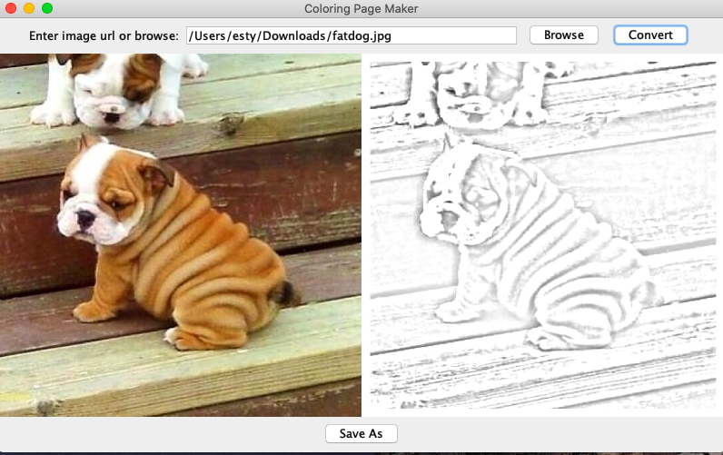

# Coloring Page Creator

## This java application allows the user to upload an image from their computer and then convert it into a coloring page. 

### The Coloring Page Creator does this by: 

1. Converting the image to grayscale. 
2. Inverting the image. 
3. Blurring the image. 
4. Color and Dodge - divide the original image by the inverted/blurred top layer to receive only the dark edges. 

### Contributers
[Michelle Berger](https://github.com/bergerm613)   
[Lillian Liebman](https://github.com/lliebman)    
[Ester Agishtein](https://github.com/ester-agishtein)

### App in Action:
1. Upload photo. 
2. Hit convert. 
3. Save your photo!  

